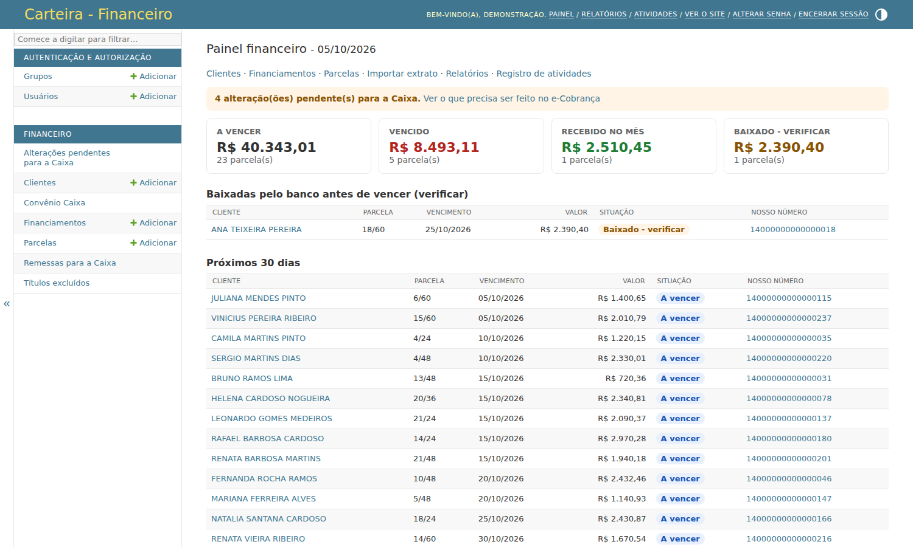
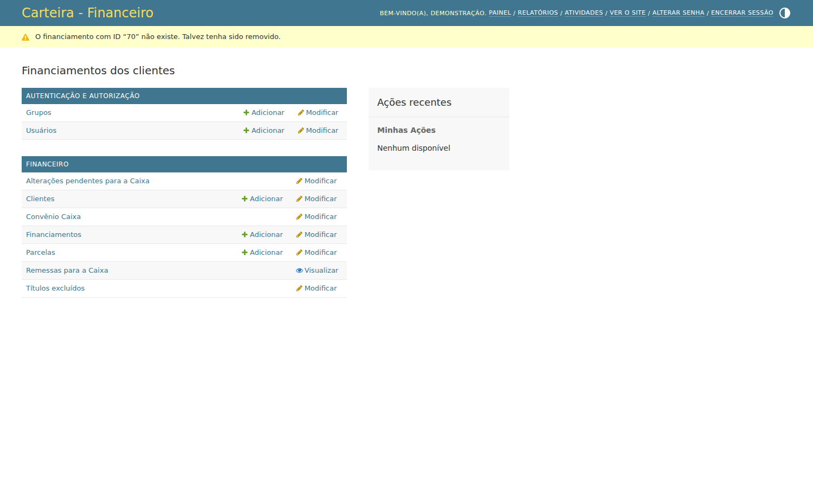
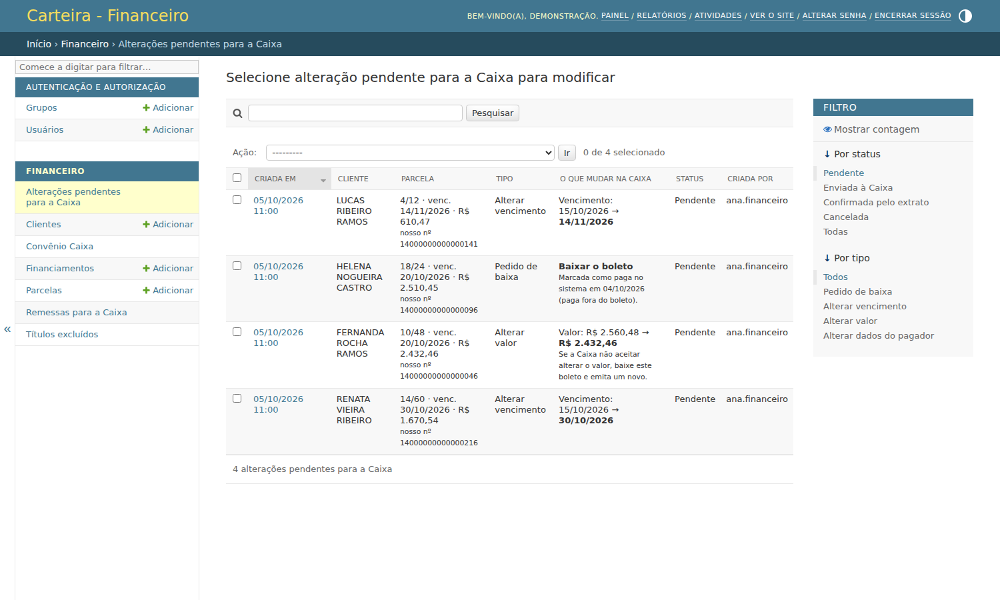
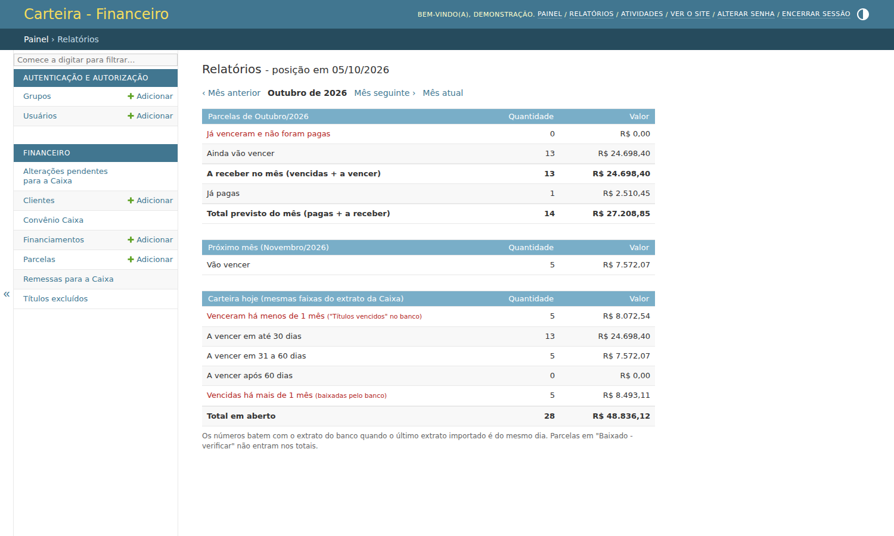
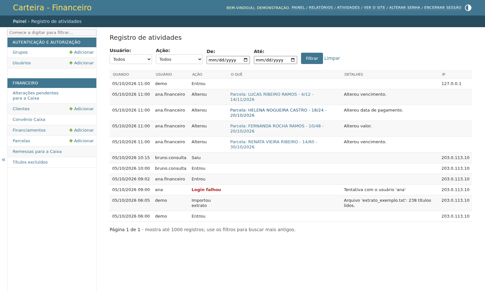
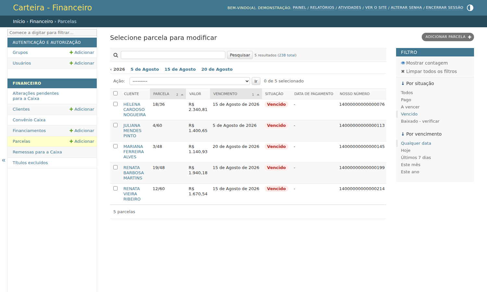
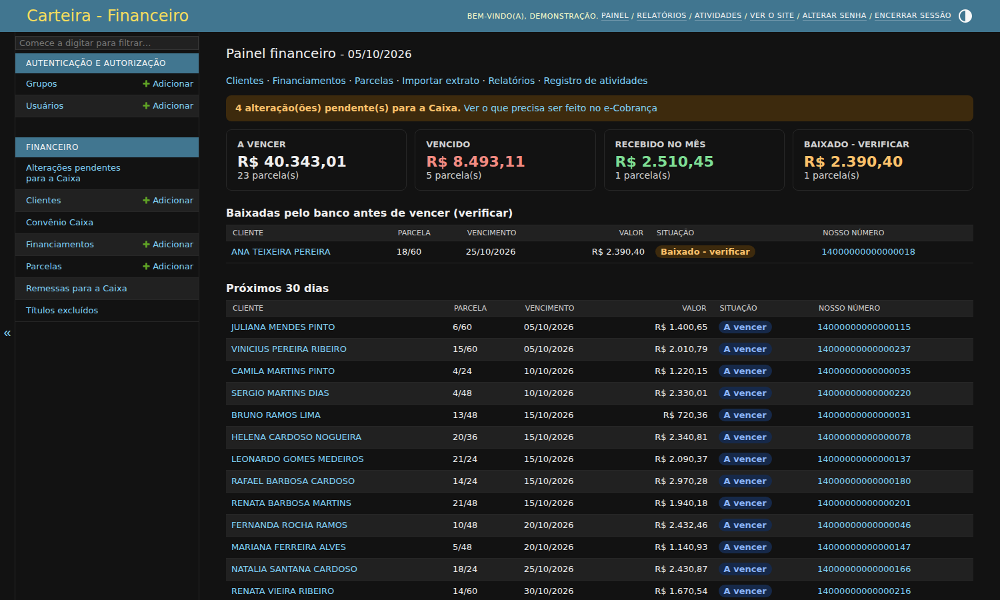
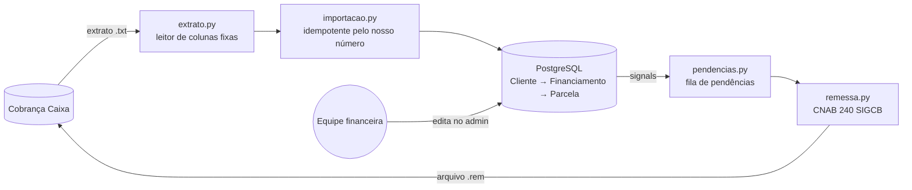

# Carteira — gestão de financiamentos de uma construtora

Sistema web que controla as vendas parceladas de uma construtora: clientes, contratos, parcelas e os
boletos registrados na **cobrança da Caixa Econômica Federal**. Ele lê o extrato de títulos do banco,
calcula a situação de cada parcela, guarda o que foi alterado no sistema e precisa ser repetido no
banco, e gera o **arquivo de remessa CNAB 240** que leva essas alterações para a Caixa.

> **Versão de portfólio.** O sistema está em uso numa construtora real. Este repositório é uma cópia
> com histórico novo e sem nenhum dado real: clientes, CPFs, valores, convênio, agência e CNPJ foram
> trocados por dados fictícios, gerados pelo comando `popular_demo`.



## O problema

A construtora vende lotes e unidades em até 60 parcelas, cobradas por boletos da Caixa. Antes do
sistema, o controle era uma planilha conferida à mão contra o extrato do banco, e qualquer mudança
(prorrogar um vencimento, dar desconto, registrar um pagamento em dinheiro) tinha de ser lembrada e
refeita no Internet Banking. O sistema resolve as três pontas:

1. **Importa o extrato do banco** ("CONSULTA DE TITULOS", texto de colunas fixas) de forma idempotente.
2. **Calcula a situação** de cada parcela (pago, a vencer, vencido, baixado - verificar) com a regra da empresa.
3. **Leva as alterações para a Caixa**: cada mudança num boleto em aberto vira uma pendência, e as
   pendências viram um arquivo de remessa CNAB 240 pronto para enviar ao banco.

## Funcionalidades

| Tela | O que faz |
|---|---|
| **Painel** (`/`) | Totais a vencer, vencido, recebido no mês e baixados para verificar; próximos vencimentos e parcelas em atraso. |
| **Relatórios** (`/relatorios/`) | Previsão de recebimento do mês e do próximo, e a carteira em aberto nas mesmas faixas do extrato da Caixa. |
| **Importar extrato** (`/importar/`) | Envio do `.txt` do banco; cria clientes, contratos e parcelas novos e atualiza os existentes. |
| **Cadastros** (`/admin/`) | Clientes (CPF/CNPJ, CEP e UF validados), contratos com as parcelas, filtros por situação e ações em massa. |
| **Alterações pendentes para a Caixa** | Fila do que mudou no sistema e ainda não está no banco, com o antes e o depois de cada mudança. |
| **Remessas para a Caixa** | Arquivos CNAB 240 gerados (numerados por NSA), para baixar e enviar ao banco. |
| **Registro de atividades** (`/atividades/`) | Auditoria: logins, falhas de login, importações e toda alteração de cadastro, com usuário e IP. |

Também tem grupos de acesso (Financeiro e Consulta; excluir é só do superusuário), tema claro e
escuro, e rota de saúde para a hospedagem.

| Contrato e parcelas | Pendências para a Caixa |
|---|---|
|  |  |

| Relatórios | Registro de atividades |
|---|---|
|  |  |

| Parcelas vencidas | Tema escuro |
|---|---|
|  |  |

## Arquitetura



| Módulo | Responsabilidade |
|---|---|
| `financeiro/regras.py` | Regra da situação da parcela (fonte da verdade, em Python puro). |
| `financeiro/models.py` | Modelos e `ParcelaQuerySet.com_situacao()`, que reproduz a mesma regra em SQL. |
| `financeiro/extrato.py` | Leitor do relatório de títulos da Caixa (latin-1, colunas fixas, validação linha a linha). |
| `financeiro/importacao.py` | Importação idempotente; não desfaz ajustes manuais nem sobrescreve campos com pendência aberta. |
| `financeiro/pendencias.py` + `signals.py` | Detecta o que mudou num boleto em aberto e cria, atualiza ou cancela a pendência. |
| `financeiro/remessa.py` | Gera o arquivo CNAB 240 (segmentos P, Q e R) a partir das pendências. |
| `financeiro/auditoria.py` | Registro de acessos e importações, somado ao histórico do admin. |
| `financeiro/demo.py` | Gerador de dados fictícios (clientes, CPFs válidos, extrato no formato do banco). |

## Regras de negócio

**Situação calculada, nunca gravada.** A situação depende da data de hoje, então não é guardada no
banco (ficaria desatualizada). Ela é calculada em Python para uma parcela e em SQL (`Case/When`) para
listas, filtros e totais. Um teste compara as duas versões parcela a parcela.

| Situação | Regra |
|---|---|
| Pago | tem data de pagamento |
| Baixado - verificar | o banco baixou o boleto antes de completar 1 mês do vencimento (cancelamento, renegociação) |
| Vencido | não pago e já passou 1 mês do vencimento |
| A vencer | todos os outros, inclusive no dia do vencimento e até completar 1 mês |

**Importação idempotente.** A parcela é identificada pelo *nosso número* do boleto, então o mesmo
extrato (ou um mais novo) pode ser importado quantas vezes for preciso. Boleto LIQUIDADO vira
pagamento com a data do último comando; ajustes manuais (pagamento em dinheiro, verificação
concluída) nunca são desfeitos; parcela excluída no sistema não volta na próxima importação.

**Pendências para a Caixa.** Ao alterar vencimento ou valor, marcar como paga, excluir uma parcela
ou mudar os dados do pagador de um boleto que está EM ABERTO no banco, o sistema cria uma pendência
com o antes e o depois. Alterar duas vezes atualiza a mesma pendência e desfazer a mudança a cancela.
Na importação seguinte, o extrato confirma as pendências que o banco já aplicou.

## Remessa CNAB 240 (Caixa SIGCB)

As pendências selecionadas no admin viram um arquivo de remessa no leiaute **CNAB 240 da Caixa
(SIGCB 67.118 v031)**: header de arquivo e de lote, segmentos P (título) e Q (pagador) para cada
boleto, segmento R quando o convênio cobra multa, e os trailers.

| Pendência | Movimento na remessa |
|---|---|
| Pedido de baixa | 02 |
| Alterar vencimento | 06 |
| Alterar valor | 47 |
| Alterar dados do pagador | 31 |

Cada campo é declarado com a posição inicial e final do manual, e a função `registro()` recusa
campos que pulam ou sobrepõem posições ou que não cabem no tamanho. Pendências que a Caixa
rejeitaria (vencimento novo no passado, pagador sem CPF, troca de CPF/CNPJ) ficam de fora com o
motivo. Enquanto o convênio está em teste, o arquivo sai como `REMESSA-TESTE`.

Remessa gerada pelo `popular_demo` (dados fictícios; cada linha tem 240 colunas, os espaços finais foram omitidos):

```text
10400000         2112223330001810000000000000000000000123076543210000000CONSTRUTORA EXEMPLO LTDA      C ECON FEDERAL                          10510202611002400000110700000                    REMESSA-TESTE
10400011R0100067 20112223330001817654321000000000000000123000000000000000CONSTRUTORA EXEMPLO LTDA                                                                                      000000010510202600000000
1040001300001P 06001230765432100000000001400000000000021611220016            3010202600000000016705400000002N1108202520000000000000000000010000000000000000000000000000000000000000000000000000000014000000000000216        30010300900000000001
1040001300002Q 061000031948939479RENATA VIEIRA RIBEIRO                   RUA DAS PALMEIRAS 801                   VILA NOVA      13098977CIDADE EXEMPLO SP0000000000000000                                        000
1040001300003R 06000000000000000000000000000000000000000000000000231102026000000000000200
10400015         000005000001000000000001670540000000000000000000000000000000000000000000000
10499999         000001000007
```

## Como rodar

Requisitos: Python 3.11+. O padrão é SQLite; para PostgreSQL defina `DATABASE_URL`.

```bash
python3 -m venv .venv && source .venv/bin/activate
pip install -r requirements.txt

export DJANGO_DEBUG=1
python manage.py migrate
python manage.py popular_demo        # dados fictícios + usuário demo / senha demo
python manage.py runserver
```

Abra http://localhost:8000/ e entre com **demo / demo**.

O `popular_demo` cria 18 clientes, os contratos e cerca de 240 boletos com datas relativas a hoje
(sempre há parcelas pagas, a vencer, vencidas e uma baixada para verificar), completa o cadastro do
pagador (alguns ficam incompletos de propósito), preenche um convênio fictício e gera quatro
pendências para a Caixa e uma remessa de teste. Outras opções:

```bash
python manage.py popular_demo --limpar                                   # apaga e popula de novo
python manage.py popular_demo --so-extrato exemplos/extrato_exemplo.txt  # só gera um extrato fictício
python manage.py importar_extrato exemplos/extrato_exemplo.txt           # importa pelo terminal
```

O arquivo `exemplos/extrato_exemplo.txt` também pode ser enviado pela tela **Importar extrato**.

## Testes

```bash
DJANGO_DEBUG=1 python manage.py test financeiro
```

São 82 testes cobrindo a regra de situação (incluindo a equivalência Python × SQL), o leitor do
extrato, a importação idempotente, a fila de pendências, as posições de cada campo da remessa
CNAB 240, relatórios, auditoria, configurações de deploy e o gerador de dados fictícios.

## Deploy

Imagem Docker (`Dockerfile` + `entrypoint.sh`: aplica as migrações, cria o admin e sobe o gunicorn),
arquivos estáticos com WhiteNoise e configuração por variáveis de ambiente. O guia de produção, com
Railway e PostgreSQL gerenciado, está em [DEPLOY.md](DEPLOY.md).

## Stack

Python 3.11 · Django 5.2 · PostgreSQL (SQLite em desenvolvimento) · gunicorn · WhiteNoise · Docker.
Código, interface e commits em português.
